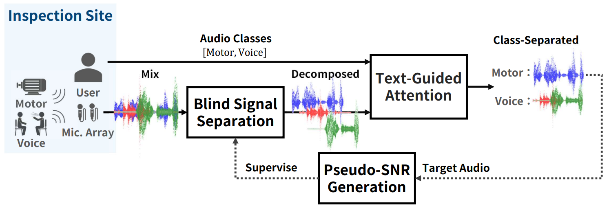
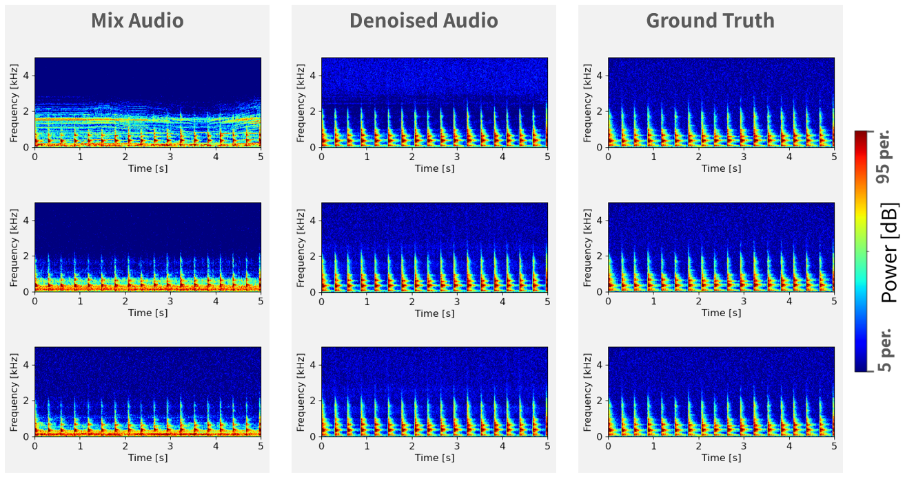
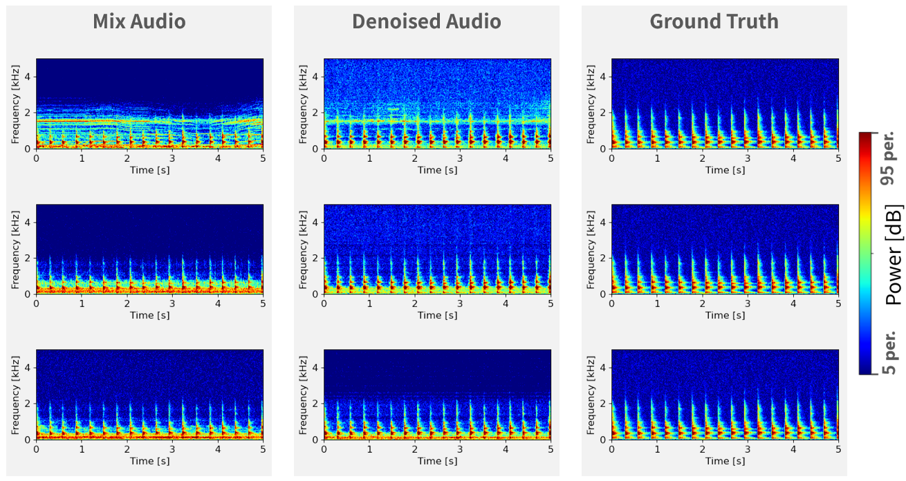

# Zero-Shot Denoiser for Enhanced Acoustic Inspection: Blind Signal Separation and Text-Guided Audio Reconstruction
This repository contains the official implementation and audio examples for the paper: 
> Koki Shoda, Jun Younes Louhi Kasahara, Qi An and Atsushi Yamashita: "Zero-Shot Denoiser for Enhanced Acoustic Inspection: Blind Signal Separation and Text-Guided Audio Reconstruction", IEEE Robotics and Automation Letters, Vol. 10, 2025.

## Architecture


## Examples
Here are some examples of the previous method (SpacialNet) and our method (Zero-Shot Denoiser).
These examples are from the real-world acoustic inspection in the paper and **audio samples are available** in the `AudioExamples` folder.

### Previous method: SpacialNet 
This result was obtained by training a model to extract tapping sounds using a large amount of training data and inferring it.  


### Our method: Zero-Shot Denoiser
This result was obtained by inferring the model without training.  


## Requirements

```bash
conda env create -f environment.yml
# This code was tested on Windows 11.
```

## Inference
`main.ipynb` is the main script for inference.  
When you apply this method to your own audio, you have to change the `audio_classes` and `sampling_rate` in `config.py`.


## Citation
If you find this work useful, please cite our paper:
```bibtex
@article{ZeroShotDenoiser,
  title={Zero-Shot Denoiser for Enhanced Acoustic Inspection: 
  Blind Signal Separation and Text-Guided Audio Reconstruction},
  author={Koki Shoda, Jun Younes Louhi Kasahara, Qi An and Atsushi Yamashita},
  journal={IEEE Robotics and Automation Letters},
  year={2025},
  volume={10},
  number={},
}
```
